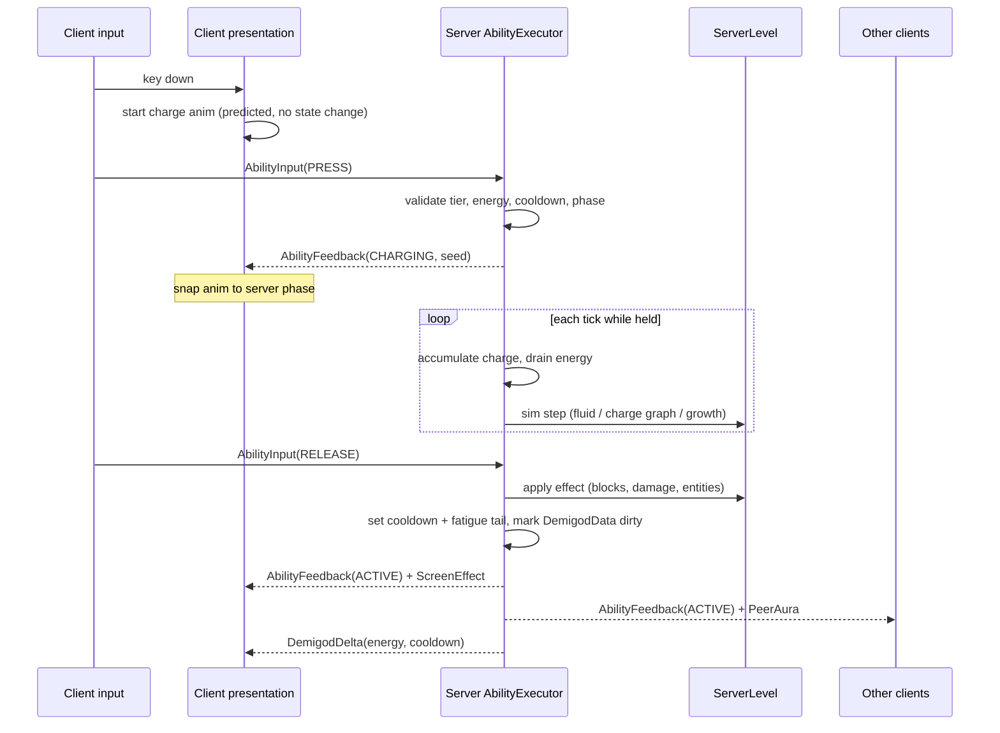
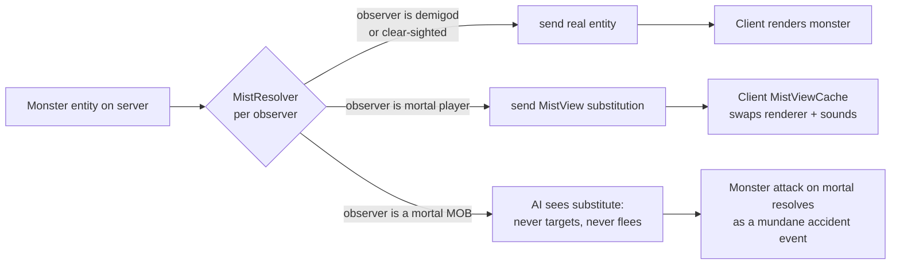

# ARCHITECTURE — Demigod: Chronicles of Olympus

**Mod ID:** `chronoly` · **Loader:** NeoForge 1.21.x · **Java:** 21

This document is the technical contract for the mod. It defines the project layout, the registry
plan, how player state is stored and synchronised, the class hierarchy behind every ability, the
dimension strategy, and the performance and testing regime. It is written to be read before any
code exists and to be argued with.

Section 15 lists every decision the brief leaves open. **Nothing in Sections 1–14 is buildable
until Section 15 is resolved**, because several of those decisions change the shape of the code
rather than its constants.

---

## 1. Where this project lives

The brief describes a standalone Gradle project. It is rooted at `demigod/` inside this
repository so it does not collide with the existing Cube Roll project at the repo root.

```
demigod/
├── ARCHITECTURE.md      ← this file
├── ROADMAP.md           ← phased build order and acceptance criteria
├── LORE_REFERENCE.md    ← (Phase 1) book/chapter citation for every content item
├── BALANCE.md           ← (Phase 3) the full numbers table
├── settings.gradle
├── build.gradle
├── gradle.properties
└── src/
    ├── main/java/...        ← mod code
    ├── main/resources/...   ← non-generated assets (models, textures, sounds, .ogg, lang seed)
    ├── generated/resources/ ← datagen output, committed, never hand-edited
    └── test/java/...        ← GameTest suite (separate source set, see §13)
```

### 1.1 Gradle shape

Single-project build (NeoForge MDK layout), not multi-module. Multi-module buys nothing here —
there is one jar — and it costs datagen and ModDevGradle configuration complexity.

Three source sets:

| Source set | Contains | Ships in jar |
|---|---|---|
| `main` | mod code, datagen providers | yes |
| `test` | GameTest classes, JUnit unit tests for pure logic | GameTests: yes (guarded by `neoforge.enabledGameTestNamespaces`); JUnit: no |
| `generated` | (resource dir only, no java) datagen output | yes |

Datagen providers live in `main` under `dev.chronoly.data`, guarded so they are never
class-loaded at runtime — they are only touched by the `runData` task. They stay in `main`
because ModDevGradle's `runData` run configuration uses the `main` source set's classpath, and
splitting them out requires hand-wiring a fourth source set for no benefit.

**CI:** `gradlew build` must pass from a clean clone with no manual steps. The CI job runs
`runData` first and then `git diff --exit-code src/generated` — a stale committed datagen output
fails the build. This is the single most useful CI rule in a datagen-heavy mod.

---

## 2. Package layout

Root package: `dev.chronoly` (see Decision **D-01**).

```
dev.chronoly
├── Chronoly.java                    mod entrypoint; constructs DeferredRegisters, binds events
├── ChronolyConstants.java           mod id, common `Identifier` helpers
│
├── registry/                        ALL DeferredRegister holders. Nothing else registers.
│   ├── ChBlocks, ChItems, ChEntities, ChBlockEntities, ChMenus
│   ├── ChParticles, ChSounds, ChEffects, ChAttributes, ChDataComponents
│   ├── ChAbilities                  static registry of Ability singletons
│   ├── ChGods                       datapack registry key + built-in bootstrap
│   ├── ChFlaws, ChEnergyProfiles, ChMistProfiles
│   ├── ChDamageTypes                ResourceKey constants; entries are datapack JSON
│   ├── ChStructures, ChChunkGenerators, ChBiomeModifiers
│   ├── ChAttachments, ChLootModifiers, ChCommandArgs, ChPoiTypes
│   └── ChRegistries.java            new-registry creation via NewRegistryEvent
│
├── core/                            engine-agnostic domain model; NO Minecraft mutation here
│   ├── god/        God, GodId, Domain, ParentageWeights
│   ├── favor/      FavorLedger, FavorEvent, FavorReason
│   ├── energy/     EnergyPool, EnergyProfile, RegenSampler, Overdraw
│   ├── flaw/       FatalFlaw, FlawTrigger, FlawEffect
│   ├── scent/      ScentModel, ScentInputs, ThreatTier
│   ├── mist/       MistState, MistRule, VeilKind
│   ├── quest/      Prophecy, ProphecyGrammar, Objective, QuestState
│   └── judgment/   LifetimeRecord, Verdict, Afterlife
│
├── ability/
│   ├── Ability.java                 the registered singleton (stateless, immutable)
│   ├── AbilityInstance.java         per-player runtime state (mutable, server-owned)
│   ├── AbilityContext.java          record: server, caster, tier, favor, energy, aim
│   ├── AbilityPhase.java            enum state machine (§6.2)
│   ├── AbilityExecutor.java         server-side per-player scheduler over all instances
│   ├── trait/                       Charged, Channeled, Toggled, Aimed, Sustained, Committed
│   ├── cost/                        EnergyCost, CooldownSpec, FatigueTail
│   ├── sim/                         the physical models (§6.4)
│   │   ├── fluid/  FluidVolume, VolumeIntegrator, DrainSolver
│   │   ├── charge/ ChargeGraph, Conductor, ArcSolver, ThunderDelay
│   │   ├── light/  LightSampler, ShadowGraph
│   │   ├── growth/ GrowthSim, PlantPlacer
│   │   └── quake/  CrackPropagator, GroundContact
│   └── impl/<god>/                  one package per parent; one class per ability
│
├── attachment/                      AttachmentType data classes + codecs (§4)
│   ├── DemigodData.java             the single player attachment (§4.1)
│   ├── MonsterMemory.java           entity attachment: reformation, grudges
│   └── ChunkWard.java               chunk attachment: ward coverage cache
│
├── net/
│   ├── ChPayloads.java              RegisterPayloadHandlersEvent wiring
│   ├── c2s/                         client→server records (§5.2)
│   ├── s2c/                         server→client records (§5.3)
│   └── sync/  SyncTracker, DirtyFlags, SnapshotBuilder
│
├── combat/
│   ├── MistCombatResolver.java      THE damage rule (§7)
│   ├── DamageAxis.java              divine / mortal / bypassing
│   └── feedback/ FirstTimeLesson.java  diegetic teaching moments
│
├── world/
│   ├── dim/       ChDimensions, transition handlers, portal logic
│   ├── labyrinth/ LabyrinthChunkGenerator, MazeGraph, GraphSavedData, Realizer, Shifter
│   ├── underworld/, olympus/, seaofmonsters/
│   ├── structure/ structure pieces, jigsaw processors, Camp Half-Blood assembly
│   ├── ward/      WardRegistry (SavedData), WardVolume, spatial index
│   └── spawn/     SpawnDirector, SpawnBudget, MonsterTable, DirectorProfiler
│
├── entity/
│   ├── monster/<book>/              one package per book's roster
│   ├── ally/                        satyrs, hellhound companion, automatons, pegasi
│   ├── npc/                         gods, Chiron, the Oracle, Charon, George & Martha
│   └── ai/                          shared goals: telegraphed attacks, pack AI, flee-on-fear
│
├── item/, block/, blockentity/, menu/
│
├── client/                          @Mod(dist = CLIENT); never referenced from common code
│   ├── ChronolyClient.java
│   ├── hud/       energy arc, favor bar, ability wheel, ambrosia burn, prophecy tracker
│   ├── render/    entity/block/armor renderers, GeckoLib bindings
│   ├── particle/  particle providers + custom `RenderSetup` pipelines
│   ├── camera/    ShakeDirector, FovPunch, ChromaticShift
│   ├── mist/      MistViewCache — render-time substitution (§8)
│   ├── input/     keybinds, charge-input handler, radial menu
│   └── sound/     ambient leitmotifs, distance-delayed thunder scheduler
│
├── config/        ChServerConfig, ChClientConfig, ChCommonConfig, ChBalance (§11)
├── compat/        jei/, emi/, curios/, jade/, patchouli/, voicechat/  (all soft, reflection-free
│                  via optional-dependency source sets guarded by ModList.isLoaded)
├── command/       /chronoly claim|favor|energy|scent|prophecy|profile|labyrinth
├── data/          datagen providers (§12)
└── mixin/         last resort only; each mixin carries a justification comment (§14)
```

**Rule enforced by review:** `core/` may not import `net.minecraft.*` except for
`Identifier`, `BlockPos`, and the codec/serialisation types. Everything in `core/` is unit
testable without a running game. This is what makes the Favor, scent, prophecy, and judgment
models testable at JUnit speed instead of GameTest speed.

---

## 3. Registry plan

### 3.1 Vanilla-registry `DeferredRegister`s

Every registry holder is a final class with a private constructor and a `public static void
init(IEventBus)`. `Chronoly`'s constructor calls each `init` in a fixed order. **No static
initialiser has a side effect** — `DeferredHolder` fields are initialised by field initialisers
whose only effect is `register()` on the DeferredRegister, which is the documented-safe pattern.

| Holder | Registry | Notes |
|---|---|---|
| `ChBlocks` | `BLOCK` | braziers, altars, wards, waystations, forges, Labyrinth marker blocks |
| `ChItems` | `ITEM` | materials, relics, armor, ambrosia/nectar, drachma |
| `ChDataComponents` | `DATA_COMPONENT_TYPE` | Stygian iron absorption, relic binding, drachma denom, Riptide pocket-return token |
| `ChEntities` | `ENTITY_TYPE` | monsters, allies, NPCs, projectiles, ability marker entities |
| `ChBlockEntities` | `BLOCK_ENTITY_TYPE` | brazier, altar, ward core, Hermes Express, Oracle |
| `ChMenus` | `MENU` | forge, express, altar, Daedalus' laptop |
| `ChParticles` | `PARTICLE_TYPE` | see §10.1 — custom types, not dust recolors |
| `ChSounds` | `SOUND_EVENT` | see §10.2 |
| `ChEffects` | `MOB_EFFECT` | exhaustion, ambrosia burn, fear, charm, petrify, drowsiness |
| `ChAttributes` | `ATTRIBUTE` | `divine_energy_max`, `energy_regen`, `scent`, `mist_sight`, `reach_bonus` |
| `ChAttachments` | `ATTACHMENT_TYPE` | §4 |
| `ChStructures` | `STRUCTURE_TYPE`, `STRUCTURE_PIECE` | |
| `ChChunkGenerators` | `CHUNK_GENERATOR` | Labyrinth only |
| `ChBiomeModifiers` | `BIOME_MODIFIER_SERIALIZERS` | scent-aware spawn augmentation |
| `ChLootModifiers` | `GLOBAL_LOOT_MODIFIER_SERIALIZERS` | drachma drops, monster dust |
| `ChCommandArgs` | `COMMAND_ARGUMENT_TYPE` | `GodArgument`, `AbilityArgument` |
| `ChPoiTypes` | `POINT_OF_INTEREST_TYPE` | camp trainers, waystations |
| `ChCreativeTabs` | `CREATIVE_MODE_TAB` | 4 tabs: materials, relics, blocks, spawn eggs |

### 3.2 Custom registries (`NewRegistryEvent`)

Two kinds, and the distinction matters:

**Static (code-defined, synced=false) — behaviour lives in Java, so it cannot be datapacked:**

| Registry key | Element | Why a registry and not an enum |
|---|---|---|
| `chronoly:ability` | `Ability` | addon mods add abilities; `AbilityInstance` refs serialise as `Identifier`; radial menu iterates the registry |
| `chronoly:fatal_flaw` | `FatalFlaw` | same; flaws carry live event hooks |
| `chronoly:ability_sim` | `SimFactory` | lets abilities compose physical models declaratively |

**Datapack registries (`DataPackRegistryEvent.NewRegistry`, synced to client where the client
needs them) — pure data, so servers and addon packs can extend them without Java:**

| Registry key | Element | Synced | Purpose |
|---|---|---|---|
| `chronoly:god` | `God` | yes | name, epithets, colours, parentage weight, ability ids by tier, flaw, energy profile, sacred animals, aligned/opposed monster tags |
| `chronoly:energy_profile` | `EnergyProfile` | yes (HUD tint) | the regen predicate stack (§4.3) |
| `chronoly:prophecy_fragment` | `Fragment` | no | the prophecy grammar corpus (§9) |
| `chronoly:mist_substitution` | `MistSubstitution` | yes | monster → mortal-visible stand-in |
| `chronoly:monster_table` | `MonsterTable` | no | spawn director tables per tier×biome |
| `chronoly:damage_type` | vanilla | yes | ~14 custom damage types |

Making `God` a datapack registry is the single highest-leverage decision in this plan: it turns
"add the Roman pantheon" or "rebalance Big Three rarity" from a code change into a datapack, and
it makes the 20-cabin content push (Phases 5–6) a data-authoring job with a fixed Java surface.

### 3.3 Tags

Tags carry the combat rule, so they are load-bearing, not cosmetic:

- Items: `chronoly:material/celestial_bronze`, `/imperial_gold`, `/stygian_iron`,
  `chronoly:divine_weapon` (the union), `chronoly:mortal_steel` (default for everything else,
  computed by exclusion rather than enumerated — see §7.2).
- Entities: `chronoly:mortal`, `chronoly:monster`, `chronoly:immortal`, `chronoly:sacred_animal/<god>`,
  `chronoly:mist_blind` (mortals who cannot see monsters), `chronoly:reforms_in_tartarus`.
- Damage types: `chronoly:is_divine`, `chronoly:is_mortal_steel`, `chronoly:bypasses_mist`,
  `chronoly:ignores_achilles`, `chronoly:is_favor_loss` (killing helpless entities).
- Blocks: `chronoly:ward_core`, `chronoly:crossroads_marker`, `chronoly:labyrinth_wall`,
  `chronoly:conducts_charge`, `chronoly:brazier`.

---

## 4. Player data model

### 4.1 One attachment, not twelve

`DemigodData` is a single `AttachmentType<DemigodData>` on the player. One attachment, because
twelve attachments means twelve serialisation round-trips, twelve dirty-tracking paths, and
twelve chances for a partial save. It is a mutable class (not a record) with a `Codec` and
explicit dirty flags.

```
DemigodData
├── parentage      : Optional<ResourceKey<God>>   // empty = Unclaimed
├── claimedAt      : long (game time)
├── flaw           : Optional<ResourceKey<FatalFlaw>>
├── favor          : Object2FloatMap<ResourceKey<God>>   // per-god, 0..1000
├── energy         : float  (current)
├── overdraw       : float  (debt; drives Exhaustion)
├── abilities      : Map<Identifier, AbilityInstance>   // cooldown, charge, active ticks
├── loadout        : List<Identifier>          // radial menu order
├── scent          : ScentModel.Snapshot (cached; recomputed on a 40-tick cadence)
├── ambrosiaBurn   : float + lastDoseTick
├── record         : LifetimeRecord   // deaths, oaths sworn/broken, innocents, quests, Elysium count
├── quest          : Optional<QuestState>
├── mist           : MistState        // active glamours, veils, pierce level
├── flags          : EnumSet<Lesson>  // which diegetic first-time lessons have fired
└── achilles       : Optional<AchillesData>  // mortal point (a body-model anchor + local offset)
```

Serialisation is **codec-based** via `IAttachmentSerializer` backed by
`Codec<DemigodData>` composed from sub-codecs, so every field is independently versioned. A
`schemaVersion` int is the first field; a `DataFixer`-style upgrade chain lives in
`attachment/upgrade/` from day one, because save-compat breakage in a progression mod is fatal.

`copyOnDeath = true` is wrong here — death is a gameplay event that *edits* the record (§4.5), so
the attachment implements `IAttachmentCopyHandler` explicitly and routes through
`DeathTransition.apply(data)`.

### 4.2 Other attachments

- `MonsterMemory` on entities: reformation countdown, the players who have killed it, whether it
  is a "notable" monster (named bosses remember you across reformations).
- `ChunkWard` on chunks: a cached bitset of which ward volumes overlap this chunk. Purely a
  cache — rebuildable from `WardRegistry` — so it is *not* persisted, avoiding a stale-cache
  save bug.
- `WardRegistry` is level `SavedData`, not an attachment, because it is a global index.

### 4.3 Divine Energy regeneration

`EnergyProfile` is a datapack-defined list of `RegenClause`s:

```
clause := { predicate: <condition>, rate: float, mode: ADD|MULTIPLY|CLAMP }
```

Predicates reuse vanilla's `LootItemCondition` / `BlockPredicate` machinery where possible
(location-based conditions, biome tags, light level, weather, fluid tags) plus a small set of
mod predicates (`near_undead`, `crossroads_pattern`, `mature_crops_within`, `recently_slept`,
`unhit_distinct_enemies`). Rate is evaluated on a **20-tick cadence per player**, not per tick,
and each predicate is allowed at most one chunk lookup.

Poseidon's "near-zero in a desert or the Nether" and Zeus's "poor underground" are `CLAMP`
clauses; the sun/moon/lava/darkness clauses are `MULTIPLY`. Athena's "distinct enemies observed
without being hit" needs a small ring buffer on `DemigodData` — the only stateful profile, and it
is called out here so it does not get bolted on later.

**Overdraw** is a debt counter, not a negative pool. Spending below zero is allowed; the debt
applies a `MobEffect` (reduced max health, slowness) and a client screen-edge vignette whose
intensity is `debt / maxEnergy`. Debt decays only while the player is *not* casting. This makes
Percy's water-fatigue a real resource-management decision rather than a hard wall.

### 4.4 Favor

`FavorLedger` in `core/` is pure: `apply(FavorEvent) -> FavorDelta`. Every gain and loss in the
brief (§4.2) becomes a `FavorReason` enum constant with a config-exposed coefficient, so the
whole economy is one table in `BALANCE.md` and one config section. Favor is per-god: you can hold
favor with your parent *and* with Hermes, which is what makes cross-god offerings meaningful.

The HUD shows the bar only for ~3s after a change (client-side fade driven by a delta payload).

### 4.5 Death

`DeathTransition` is the only writer of `LifetimeRecord`. On death:
1. Compute `Verdict` from the record (Elysium / Asphodel / Punishment).
2. Write the verdict into the attachment.
3. Route the player to the Underworld dimension as a shade rather than firing the respawn screen.

Keep-inventory interaction is **D-05**.

---

## 5. Networking

### 5.1 The one rule

**The server owns all game state. The client owns only presentation.** The client never predicts
damage, energy, favor, block changes, or mist truth. It predicts *animation* — a charge-up
animation starts on keypress before the server acknowledges, and snaps to the server's phase if
they disagree. Every C2S payload is an *intent*; every S2C payload is either a *state snapshot*
or a *presentation instruction*.

This rule is why the Mist can never be a client-only illusion (§8) and why Charmspeak cannot be
resolved on the client (§15, D-06).

### 5.2 Client → server

All registered via `RegisterPayloadHandlersEvent` as `CustomPacketPayload` records with
`StreamCodec`s. All are rate-limited server-side by a per-player token bucket; exceeding it logs
and drops rather than kicks.

| Payload | Fields | Validation |
|---|---|---|
| `AbilityInput` | abilityId, `InputPhase` (PRESS/HOLD_TICK/RELEASE/CANCEL), clientTick | ability must be registered, unlocked at the player's tier, and in a phase that accepts this input; aim is **re-derived server-side** from the player's look vector, never trusted from the client |
| `LoadoutSet` | ordered ability ids | ids must be unlocked |
| `Utterance` | charmspeak command enum + target id | enum, not free text (see D-06); target must be within range and line of sight |
| `IrisOpen` | target player id | requires a valid rainbow + drachma, re-verified server-side |
| `AltarOffer` | slot | container must be open and be an altar |
| `OracleConsult` | — | proximity + quest-trigger re-verified |
| `MistFocus` | target id, veil kind | Hecate abilities; server decides whether it lands |
| `ClientSettingsSync` | HUD prefs that the server needs (e.g. shake intensity 0 = don't send shake) | clamped |

### 5.3 Server → client

| Payload | When | Contents |
|---|---|---|
| `DemigodSnapshot` | join, respawn, dimension change | full `DemigodData` view (self only) |
| `DemigodDelta` | on dirty flag, at most 1/tick/player | only changed fields; a bitset header |
| `PeerAura` | when a nearby player's public state changes | parentage, tier, active visible abilities, glamour — the subset other players may see |
| `AbilityFeedback` | ability phase transitions | abilityId, phase, position/direction, seed for deterministic VFX |
| `MistView` | on mist state change, per-observer | which entities this observer renders as substitutes, and as what |
| `ScreenEffect` | shake / FOV punch / chromatic shift / distortion | intensity, duration, curve id — client scales by its own config |
| `ClaimCeremony` | on claiming | player id, god, duration; all clients in range play it |
| `ProphecySync` | quest start/step | the five lines + objective markers |
| `LessonToast` | first time a Mist rule fires for you | which lesson |
| `ThunderCue` | lightning | strike position + server tick, so each client computes its own audio delay by distance |

### 5.4 Data flow — ability cast



The seed in `AbilityFeedback` matters: it lets every client generate the same particle scatter
without the server sending particle data, which is how the 400-particle budget stays affordable
on a 20-player server.

### 5.5 Data flow — Mist perception



The substitution decision is **made on the server, per observer**, and shipped as a `MistView`
payload. The client's `MistViewCache` is a pure lookup consulted at render time. The client is
never asked to decide what is true — only how to draw what the server already decided.

---

## 6. The ability framework

### 6.1 Three objects, clearly separated

| Object | Lifetime | Mutability | Lives where |
|---|---|---|---|
| `Ability` | one per registry entry, forever | **immutable** | `chronoly:ability` registry |
| `AbilityInstance` | one per (player, ability) | mutable, server-owned | inside `DemigodData` |
| `AbilityContext` | one per invocation | record, immutable | stack |

`Ability` holds no per-player state. This is not style — it is the difference between a mod that
works with 20 players and one that leaks state between them.

### 6.2 The phase state machine

```
IDLE ──PRESS──> ARMED ──(hold)──> CHARGING ──RELEASE──> ACTIVE ──> COOLDOWN ──> [FATIGUE] ──> IDLE
  ^                │                  │                    │
  └────CANCEL──────┴──────CANCEL──────┘         (Sustained abilities loop in ACTIVE
                                                 while energy holds; Toggled abilities
                                                 stay ACTIVE until re-pressed)
```

`AbilityExecutor` ticks the machine for every player once per server tick. Its inner loop **early-outs
on an `IntOpenHashSet` of non-IDLE instance ids** — a player with no active abilities costs one
set-emptiness check per tick, which is how the sub-0.5 ms budget is met with 20 demigods online.

### 6.3 Traits, not a class hierarchy

Abilities compose interfaces rather than extending a deep tree:

```java
interface Ability { AbilityResult tick(AbilityContext ctx, AbilityInstance inst); }
interface Charged   { int maxChargeTicks(); float scaleAt(int t); }   // release-early support
interface Channeled { void onChannelTick(...); }                     // Apollo's Healing Hymn
interface Toggled   { }                                              // Umbrakinesis
interface Sustained { float energyPerTick(); }                       // Wind Walk
interface Committed { }                                              // Avatar of War — cannot cancel
interface Aimed     { AimMode mode(); }                              // ray / cone / area / entity
interface PvpScaled { float pvpCoefficient(); }                      // §10 balance requirement
```

An ability declares its costs via a `CostSpec` record (energy curve, cooldown, fatigue tail) whose
every number is read from `ChBalance` at load, satisfying the "no hardcoded coefficients" rule
mechanically rather than by discipline.

### 6.4 The physical models

The brief's first design contract — *physical model first* — is enforced by making the simulations
shared, reusable classes rather than per-ability code. An ability that "shoots a projectile that
does 8 damage" cannot be written in this framework without visibly bypassing `sim/`.

| Sim | Model | Used by |
|---|---|---|
| `FluidVolume` | A set of source cells with velocity and mass; integrated on a fixed step; drains toward gravity; places/removes fluid blocks only at volume boundaries to bound block updates | Hydrokinesis, Water Jet, Whirlpool, Hurricane |
| `ChargeGraph` | Nodes = conductive entities/blocks (tag-driven); edges weighted by distance and conductivity; arcs solved as a min-cost tree from the strike point; ionisation particles precede the strike; thunder is a `ThunderCue` with per-client distance delay | Static Charge, Lightning Bolt, Master Bolt, Storm Call |
| `LightSampler` / `ShadowGraph` | Real light-level sampling to find shadow cells; a reachability graph between them | Umbrakinesis, Shadow Travel, Helm of Darkness |
| `GrowthSim` | Block placement over a growth front with a per-tick budget and a persistence policy | Chlorokinesis, Entangle, Grove, Wild Growth |
| `CrackPropagator` | Surface-following BFS from an epicentre; applies knockdown to ground-contact entities only | Earthshaker, Fissure |
| `HeatField` | Temperature per cell; ignites, degrades armor durability, spreads | Molten Grasp, Greek Fire, Solar Flare, Chariot of the Sun |

Every sim carries a hard **work budget per tick** and a hard **entity/block cap**, both config
exposed. A sim that exceeds its budget degrades (fewer cells, coarser step) rather than lagging
the server. This is the mechanism behind the perf requirement — not a hope.

### 6.5 Tiers

`Tier` is derived, never stored: `tier(favor) = 0→T1, 200→T2, 500→T3, 850→T4`, thresholds in
config. An `Ability` declares `minTier()`, and higher tiers select a **different behaviour branch**
inside the ability (the brief's "change kind, not just numbers"), expressed as a
`switch (tier)` over a sealed `TierBehaviour` interface so the compiler enforces that every tier
is handled.

---

## 7. The Mist combat rule

This is the mod's most important rule and gets a single, central implementation.

### 7.1 The matrix

Resolved in `MistCombatResolver`, hooked to NeoForge's `LivingIncomingDamageEvent` (early
priority, before armor/enchant math).

| Attacker's damage axis | Target class | Result |
|---|---|---|
| divine (bronze/gold/stygian) | mortal (villager, vanilla passive/hostile) | **cancelled** — weapon passes through; phase-through VFX + sound |
| divine | monster / immortal | full damage |
| mortal steel (all vanilla weapons) | monster | **cancelled** — blade passes through; a "your sword goes through it" lesson |
| mortal steel | mortal | full damage |
| either | demigod player | full damage — demigods are half-mortal, half-divine and are hit by both |
| tagged `bypasses_mist` (fire, fall, magic, drowning, Greek fire) | anything | full damage |

### 7.2 Why `mortal_steel` is computed by exclusion

Enumerating "every vanilla weapon" is a tag that goes stale the moment another mod adds a sword.
Instead: an attack is *divine* if its weapon stack is in `chronoly:divine_weapon` **or** its damage
type is in `chronoly:is_divine`; it *bypasses* if its damage type is in `chronoly:bypasses_mist`;
otherwise it is **mortal steel by default**. New mods' weapons therefore correctly fail against
monsters without anyone updating a tag, which is the behaviour the lore wants.

### 7.3 Teaching it

`FirstTimeLesson` fires once per player per rule, gated on a flag in `DemigodData`: a chat line in
the books' register, a distinct sound, and the phase-through particle. The player learns the rule
from the world, not from a wiki. Config can relax the rule (**default strict**, per the brief).

---

## 8. Mist perception and glamour

The hard requirement: *server-authoritative, never a client-only illusion the server disagrees
with.* Three layers:

1. **Server truth.** `MistState` on the player (glamour active, veil radius, pierce level) plus
   `MistSubstitution` datapack entries mapping monster → mortal stand-in.
2. **Per-observer resolution.** For each (observer, subject) pair a `MistResolver` returns
   `REAL | SUBSTITUTE(x) | HIDDEN`. Demigods, clear-sighted mortals, Athena's *Pierce the Mist*,
   and anything with `mist_sight > 0` see `REAL`.
3. **Client render substitution.** `MistViewCache` swaps the renderer, model, name, and sound
   set at render time from the synced resolution. AI-side, mortal mobs get the same answer through
   a targeting filter so they genuinely never react to monsters.

Mortal-facing monster attacks resolve as mundane accidents: the damage is real, the presentation
is a `MistAccident` (stray dog, gas explosion) chosen by the substitution entry, with matching
sound and particles.

**The open question is how much render substitution to attempt** — full entity swap vs. model/
texture swap vs. monsters-only. See **D-09**; it is the largest single technical risk in the mod.

---

## 9. Prophecy generation

`ProphecyGrammar` is a weighted CFG over a datapack fragment corpus. Generation is
**objective-first**, which is what makes prophecies "ambiguous in phrasing, unambiguous in
mechanics":

```
1. QuestPlanner picks a solvable objective set:
     target (named monster) × place (generated structure, reachable) × cost (a betrayal, a loss,
     a deadline) × relic
2. Each objective element carries a set of ALLOWED KENNINGS ("the one who forgot the sea",
     "where the bronze bull sleeps")
3. ProphecyGrammar assembles 5 lines: 2 rhyming couplets + a final line, choosing kennings that
     refer only to elements the planner actually placed
4. QuestState stores the machine-readable objectives; the text is a VIEW of them
```

The text is therefore never parsed to determine the objective — a class of bug this design makes
impossible. Rhyme is enforced by tagging each fragment with a rhyme class and requiring line 2 and
line 4 to match line 1 and line 3's class. Localisation: **D-17**.

---

## 10. Presentation architecture

### 10.1 Particles

Custom `ParticleType`s with their own render setup (own pipeline/blend/texture atlas), not
`dust` recolors, for: flowing water volumes, ionised air, golden monster dust, shadow tendrils,
Greek fire, divine sigils, celestial-bronze phase-through, mist shimmer. Signature abilities get a
dedicated type; ambient effects may reuse.

**1.21.11 note:** the old `RenderType`-static approach is gone. Custom render types are built with
`RenderSetup#builder` against an explicit `RenderPipeline`, and the vanilla types moved from
`RenderType` to `RenderTypes` (§17). All custom particle rendering goes through one
`ChParticlePipelines` holder so the whole mod has a single place to touch when this API moves
again — and it will, because 1.21.11 is the last obfuscated version and the rendering stack is
still in motion.

The 400-particle-per-instance budget is enforced by a `ParticleBudget` helper that every emitter
must go through — it takes a seed (from `AbilityFeedback`), a count, and a scale from client
config, and refuses to exceed the cap.

### 10.2 Sound

Original event set with subtitles, distance attenuation, and reverb tags. Thunder is scheduled
client-side from `ThunderCue` (position + tick) so the delay is genuinely a function of distance
per listener. Charmspeak carries a processed voice layer as a separate simultaneous event.
Per-god ambient leitmotifs play through a `MusicManager` override with a cooldown so they never
stack.

### 10.3 Camera and HUD

`ShakeDirector` composes multiple concurrent shake sources with a global client-config intensity
scalar (0 disables entirely, and the server is told so it can skip the payload). HUD is a
`LayeredDraw` set of independently toggleable, repositionable layers: energy arc, favor bar
(fades unless changing), radial ability wheel, ambrosia burn counter, prophecy tracker. Positions
persist in client config.

---

## 11. Config

Three `ModConfigSpec`s:

- **Server** (`chronoly-server.toml`, per-world, authoritative): parentage weights and mode, Big
  Three rarity, strict-Mist toggle, PvP coefficients, ability kill-switches (Charmspeak, Fissure,
  Curse of Achilles, Blink, Traveler's Road), spawn director rates, keep-inventory interaction,
  dimension enables.
- **Common** (`chronoly-common.toml`): tier thresholds, favor coefficients, energy curves, ability
  numbers. This is the machine-readable twin of `BALANCE.md`.
- **Client** (`chronoly-client.toml`): HUD layout and toggles, shake intensity, particle scale,
  glamour render quality, subtitles.

Balance values are read through `ChBalance`, a cached view rebuilt on config reload, so abilities
never touch `ModConfigSpec.ConfigValue` in a hot loop. Hot reload is supported for anything that
does not change registry contents or world state; anything that does is marked `.worldRestart()`.

---

## 12. Datagen

Everything generated: recipes, loot tables, tags, models, blockstates, advancements, lang, damage
types, biomes, structures, biome modifiers, and the built-in `God`/`EnergyProfile`/
`MistSubstitution`/`MonsterTable` datapack entries. `src/generated/resources` is committed and CI
fails if it drifts (§1.1).

Lang is generated from the same source as tooltips so the "books' voice" copy lives in one Java
file per content area and cannot drift from the item it describes.

---

## 13. Testing

| Layer | Tool | Covers |
|---|---|---|
| Pure domain | JUnit (no Minecraft) | FavorLedger, ScentModel, ProphecyGrammar solvability, Judgment routing, EnergyProfile evaluation, MazeGraph invariants |
| Combat rule | GameTest | the full §7.1 matrix — every cell, both directions, plus `bypasses_mist` |
| Persistence | GameTest | `DemigodData` save/load round-trip incl. every schema-upgrade step |
| Abilities | GameTest | each ability: casts, costs energy, respects cooldown, terminates its sim, leaves no orphaned blocks/entities |
| Dimensions | GameTest | Overworld↔Underworld↔Labyrinth↔Olympus transitions preserve attachment state |
| Labyrinth | JUnit + GameTest | generator determinism for a fixed seed; every generated maze has a solvable path; shifting never strands a player |
| Performance | a `/chronoly profile` harness | spawn director and Labyrinth generator report **numbers** (§14) |

**Acceptance rule:** an ability without a GameTest is not finished, and the brief's "never stub"
rule is enforced by this — a stub cannot pass "leaves no orphaned blocks/entities".

---

## 14. Performance and mixins

**Budget:** < 0.5 ms/tick server overhead with 20 demigods online. Enforced by:

- Cadenced work: scent recompute every 40 ticks, energy regen every 20, spawn director round-robin
  across players so at most `players/20` are evaluated per tick.
- Early-out first: every per-player tick loop begins with a cheap emptiness/flag check.
- Sim work budgets with graceful degradation (§6.4).
- Spatial indices for wards and crossroads rather than radius scans.
- `/chronoly profile` dumps per-system ms/tick to chat and a CSV; Phase 8 and Phase 10 acceptance
  criteria require published numbers, not vibes.

**Mixins:** last resort. Every mixin carries a comment naming the event or hook that was searched
for and does not exist, and a link to the NeoForge issue where it should. Expected unavoidable
mixin sites, to be confirmed against 1.21.x's actual event surface: the entity-render substitution
hook for the Mist, and the mortal-mob targeting filter. Everything else should be events.

---

## 15. DECISIONS I NEED FROM YOU

Per the brief's *Rules of Engagement* — ask before inventing. **Answers live in `DECISIONS.md`;**
**this section is the reasoning behind each question.** They are ordered by how much code
they change. **D-01 through D-04 block Phase 1.**

### Blocking Phase 1

**D-01 — Java package root and Maven coordinates.** Options: `dev.chronoly` (recommended, neutral,
matches mod id), `com.<yourhandle>.chronoly`, or something tied to a publishing identity you
already have. Affects every file, so I want it right the first time.

**D-02 — Exact 1.21.x target.** "Latest stable 1.21.x" spans real API breaks: 1.21.1 has the
largest mod ecosystem (GeckoLib, Curios, JEI, Jade, Patchouli all mature), while 1.21.4+ has a
different rendering stack and thinner soft-dep availability. Recommendation: **pin 1.21.1** for
the build, keep rendering code behind a thin abstraction so a later port is bounded. Tell me if
you want the newest instead and accept thinner compat.

**D-03 — Hard vs soft GeckoLib dependency.** Every monster and most abilities want it. Hard
dependency (recommended) is simpler and matches the brief; it means the mod refuses to load
without it. Confirm.

**D-04 — Art and audio pipeline.** The brief specifies GeckoLib models and full animation sets for
~60 monsters plus original sound design. That is not something I can generate. Options: (a) I build
everything with placeholder geometry and a documented art-request list per entity, and you or an
artist replace them; (b) I scope the monster roster down to what can be shipped finished; (c) you
supply models/sounds as the phases land. This determines whether "never stub" is achievable at the
roster size in §6 of the brief.

### Blocking gameplay design

**D-05 — Death and keep-inventory.** With `keepInventory=false`, does the Underworld run happen
*with* your items (dropped at the death site, recoverable after escape) or do you arrive as a shade
with nothing? Recommendation: shade arrives empty-handed; items stay at the death site with an
extended despawn; escaping returns you there. With `keepInventory=true`, the Underworld run still
happens but the stakes become time and the curse/buff. Confirm both branches.

**D-06 — Charmspeak's input surface.** The brief says "speak a real command in chat". Free-text
natural-language parsing is unshippable and unbalanceable. Recommendation: a **bounded verb
grammar** — a fixed set of commands (STOP, FLEE, DROP, ATTACK <target>, KNEEL, FORGET) selected
from a radial menu or typed as a short phrase matched against a localised alias list, so it reads
like speech and behaves like an enum. Against players: short duration, resistible, loudly
telegraphed, **off by default**, config kill-switch. Confirm the grammar approach and the
default-off.

**D-07 — Fissure to the Underworld vs. players.** Sending another player to a dimension against
their will is the most grief-capable thing in the mod. Recommendation: default **off for players,
on for mobs**; when enabled, it requires the target to be below a health threshold and gives them
a resist window. Confirm.

**D-08 — Curse of Achilles termination.** The brief flags this as lore-flexible. Canon: Percy loses
it in the Little Tiber, a *blessed river*, not salt water generally. Options: (a) any salt water
(as written in the brief, simplest, harshest — the sea is everywhere), (b) a blessed/consecrated
water source only (closer to canon, rarer, makes the curse a long-term state), (c) it ends on
death. Recommendation: **(b)**, with the mortal point relocating on each new bath. Your call —
it changes how endgame Poseidon plays.

### Blocking major systems

**D-09 — Mist render substitution depth.** Three implementations, very different costs:
 (a) **Full entity swap** — the server sends mortals a genuinely different entity type. Truest to
 the lore, breaks nothing client-side, but doubles entity tracking cost and is fragile.
 (b) **Render-time substitution** (recommended) — one entity on the server; the client draws a
 different model/name/sound per the synced `MistView`. Cheap and robust; a determined client mod
 could see through it, which for a co-op mod is acceptable.
 (c) **Monsters-only** — no player glamour at all, which guts Hecate and Aphrodite.
 This is the single biggest technical decision in the mod. I recommend (b).

**D-10 — Iris-Messaging's "live view".** Rendering another player's camera into a floating window
means a second full world render pass per open message — a frame-rate catastrophe on a busy
server. Options: (a) true remote render, capped to one concurrent message and a low-res target;
(b) **a stylised scrying view** (recommended) — the target's surroundings rendered as a
low-detail silhouette scene with real entity positions, which reads as magical rather than as a
webcam; (c) audio + a static portrait only. And separately: real voice requires a soft-dep on
Simple Voice Chat — do you want that dependency, or a text channel styled as speech?

**D-11 — Lotus Hotel time dilation.** Minecraft ticks one rate per server. "Hours pass outside per
minute inside" cannot be done by ticking faster. Options: (a) invert it — the *inside* is slowed
for the player (their hunger, cooldowns, and quest deadlines advance at outside rate while their
subjective session is short), which produces the book's horror on exit correctly; (b) skip the
world clock forward on exit (cheap, but other players experience nothing); (c) an actual separate
dimension with accelerated random ticks (expensive, still not real time dilation). Recommendation:
**(a)**, with the deadline pressure of an active quest as the teeth.

**D-12 — Sea of Monsters: dimension or overworld region?** A dimension gives control over
generation and the Bermuda-Triangle transition; an overworld region lets you genuinely sail there
and keeps one world. Recommendation: **a dimension** entered by sailing into a generated anomaly,
because Ogygia, Circe's island, and Scylla's strait each need authored geography that overworld
generation will fight.

**D-13 — Alaska, "beyond the gods' reach".** Minecraft has no Alaska. Options: (a) a far-north
*coordinate band* (e.g. |Z| beyond N thousand) tagged as godless — simple, works in any world,
geographically arbitrary; (b) a **biome-tag region** (snowy taiga/ice spikes past a distance
threshold) — recommended, reads naturally; (c) a separate dimension — clean but loses "you sailed
too far north". Recommendation: (b).

**D-14 — "Only a child of Ares may kill the Lydian Drakon."** Strictly enforced, this hard-blocks
a boss for servers with no Ares child. Options: (a) strict (as the prophecy demands) with the
drakon simply not spawning until an Ares child exists; (b) strict, but any player may *weaken* it
while only an Ares child lands the kill; (c) enforced by damage multiplier rather than immunity.
Recommendation: (b) — the party mechanic the books actually depict.

**D-15 — Parent assignment default.** Weighted random (books-accurate: you don't choose) vs.
Altar of Offering (player agency, better for servers). Recommendation: **weighted random by
default**, altar available as a server option, Big Three at a low default weight. Confirm the Big
Three weight — I'd suggest 3% combined.

**D-16 — Rebirth Token rarity and whether reparenting resets Favor.** Recommendation: extremely
rare Fields-of-Punishment drop; reparenting keeps Favor with the *old* god (you don't lose what
you earned) but starts the new parent at 0.

**D-17 — Prophecy localisation.** Runtime-assembled text cannot be translated as whole strings.
Options: (a) generate from a per-language fragment corpus (translatable, but rhyme and scansion
must be re-authored per language — a real burden on translators); (b) English-only prophecies with
everything else localised. Recommendation: (a) with English as the only shipped corpus and clear
docs for translators.

**D-18 — Hunters of Artemis vow scope.** "Forswear romance-flagged mechanics" only means anything
with specific compat mods installed. Recommendation: scope the vow to mod-internal consequences
(no Aphrodite abilities, Aphrodite hostility, loss of the vow on breaking it) and treat compat-mod
marriage blocking as an optional integration, not a launch feature.

**D-19 — Titan corruption path.** The brief calls it "very late-game" and "may". Is this in scope
for v1.0, or deferred? Recommendation: **defer past 1.0** — it is an entire second progression
tree and Phases 1–14 are already very large.

**D-20 — Roster scope vs. "never stub".** Sections 5, 6, and 7 of the brief specify roughly 90
abilities, ~60 monsters, ~40 named relics, and 5 dimensions. Held to "every ability ships
finished, animated, sounded, balanced", this is a multi-year scope at full art fidelity. The
brief's own rule — *"if a phase is too large, do less of it completely rather than all of it
partially"* — points at cutting the roster, not the quality bar. Recommendation: define a **v1.0
cut** now (the Big Three + Athena, Ares, Apollo, Hermes, Hecate; Books 1–2 monsters; Camp
Half-Blood, the Underworld, the Labyrinth) and treat the rest as post-1.0 content phases. I want
your agreement on this before Phase 1, because it changes the roadmap's shape.

**D-21 — Distribution and naming.** *Percy Jackson & the Olympians* is Rick Riordan's and
Disney's IP. A non-commercial fan mod is normal practice in the Minecraft ecosystem, but the mod
should not carry commercial monetisation, and the README should state it is an unofficial fan
work. Flagging it once so it is a deliberate choice rather than an oversight; it changes nothing
technical.

---

## 16. What I need to verify before implementing

Per the brief's own instruction: **Books 6 and 7** (*The Chalice of the Gods*, *The Wrath of the
Triple Goddess*) are the newest and the ones most likely to be got subtly wrong. Before Phase 12,
I need either source access or your confirmation on: Geras's encounter structure, Nereus's
transformation sequence, the exact roster of Hecate's animals and what leaks out of her
collection, and the shape of the Ganymede chalice quest. I will not write those from memory, and
`LORE_REFERENCE.md` will carry an explicit confidence note wherever the mod invents rather than
adapts.

---

## 17. Platform notes — Minecraft 1.21.11 / NeoForge 21.11

Pinned per **D-02**. These are verified against the NeoForged 1.21.10 → 1.21.11 migration primer,
not written from memory, and they change code shape rather than constants.

### 17.1 `ResourceLocation` is now `Identifier`

The rename is global — method names, parameters, and related classes. It is mechanical but total:

| Was | Is |
|---|---|
| `ResourceLocation` | `Identifier` |
| `ResourceLocationException` | `IdentifierException` |
| `ResourceLocationArgument` | `IdentifierArgument` |
| `ResourceLocationPattern` | `IdentifierPattern` |
| `FriendlyByteBuf#readResourceLocation` / `write…` | `readIdentifier` / `writeIdentifier` |
| `ResourceKey#location` | `ResourceKey#identifier` |

This document uses `Identifier` throughout. Most utility classes also moved to
`net.minecraft.util`, and `net.minecraft.advancements.critereon` became `…advancements.criterion`
— which the advancement datagen providers (§12) touch directly.

### 17.2 The rendering stack moved under us

- `RenderType`'s statics are now on `RenderTypes`; custom types are built via `RenderSetup#builder`
  with an explicit `RenderPipeline`.
- Block/terrain pipelines split: `SOLID` → `SOLID_BLOCK` / `SOLID_TERRAIN`, `CUTOUT` →
  `CUTOUT_BLOCK` / `CUTOUT_TERRAIN`, `TRANSLUCENT` → `TRANSLUCENT_TERRAIN`.
- Texture binding now takes an explicit `GpuSampler` (`AddressMode` and `FilterMode` live there).
- Items have their own atlas, `minecraft:items`, separate from the block atlas.

Consequence: **every custom render path in the mod is funnelled through `client/render/pipeline/`**
— particles, the Mist substitution draw, the Iris scrying view, and the HUD. One package to port
when this moves again, rather than sixty call sites.

### 17.3 `DimensionSpecialEffects` is gone — environment attributes replace it

Sky colour, fog, cloud colour, and star brightness are no longer a client class you subclass;
they are **registry-backed environment attributes with timelines**, activated through
`DimensionType#timelines` tags. `ClientLevel#getSkyColor` / `getSkyDarken` / `getCloudColor` /
`getStarBrightness` are removed.

This is better for us than what it replaced. The Underworld's grey Asphodel light, Elysium's
warmth, the Labyrinth's dead air, and Olympus' gold become **datapack-authored attributes with
interpolation** rather than hand-written client code — which means the atmosphere of each
dimension is tunable without a recompile, and Hecate's Veil of Night has a legitimate hook for
rewriting a region's *look* through the same system the dimensions use.

### 17.4 Permissions are no longer integers

`Commands#LEVEL_*` are `PermissionCheck`s, not `int`s; `CommandSourceStack` takes a
`PermissionSet`; `Player#getPermissionLevel` is now `permissions`. The `/chronoly` operator
subcommands (`claim`, `favor`, `profile`) are written against `PermissionCheck` from the start.

### 17.5 New weapon data components are a gift to the Mist rule

1.21.11 added `DAMAGE_TYPE`, `ATTACK_RANGE`, `SWING_ANIMATION`, `USE_EFFECTS`,
`MINIMUM_ATTACK_CHARGE`, `PIERCING_WEAPON`, and `KINETIC_WEAPON` as vanilla data components.

Two places this simplifies the design:

- **§7's damage axis** no longer needs a bespoke mechanism to ask "what damage type does this
  weapon deal?" — a celestial bronze sword declares `DAMAGE_TYPE: chronoly:celestial_bronze`
  directly, and `MistCombatResolver` reads a vanilla component instead of a mod-specific lookup.
  The `chronoly:divine_weapon` tag stays as the belt-and-braces path for weapons from other mods.
- **Ares' `+reach`** (§5.5 T1) uses vanilla `ATTACK_RANGE` rather than a custom attribute, so it
  composes correctly with anything else that touches reach.

### 17.6 What the primer does not cover — verify in Phase 1

The migration primer says nothing about `DeferredRegister`, the `CustomPacketPayload` /
`StreamCodec` networking API, data attachments, chunk generators, damage types, or GameTest. Silence
is *probably* stability, but this architecture leans hard on all six, so Phase 1's acceptance
criterion includes standing each one up for real — an empty registry, a round-tripped payload, a
persisted attachment, a trivial custom chunk generator, a datapack damage type, and a passing
GameTest — **before** any content is written on top of them.

### 17.7 Forward note

1.21.11 is the last obfuscated version of the game. Future versions ship deobfuscated, which will
make the *next* port materially easier but does not help this one. The `client/render/pipeline/`
funnelling in §17.2 and the single `Identifier` helper in `ChronolyConstants` are the two places
that make the eventual move cheap.
