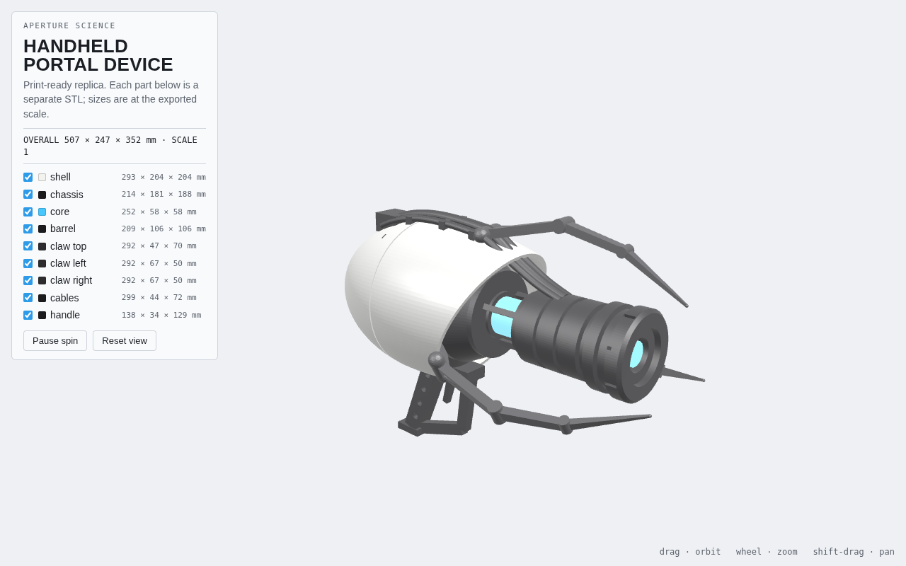
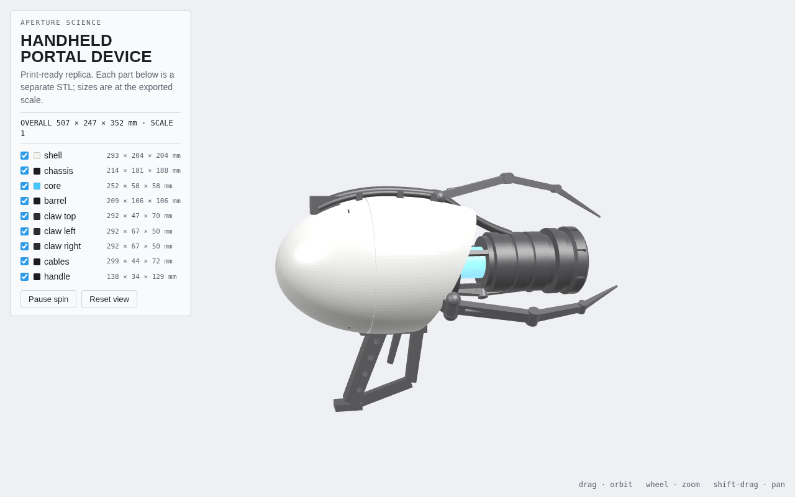
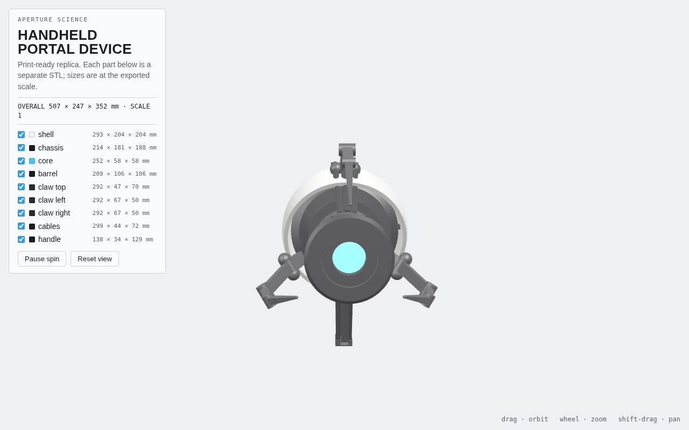
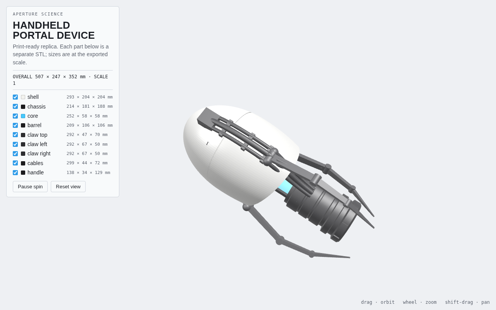
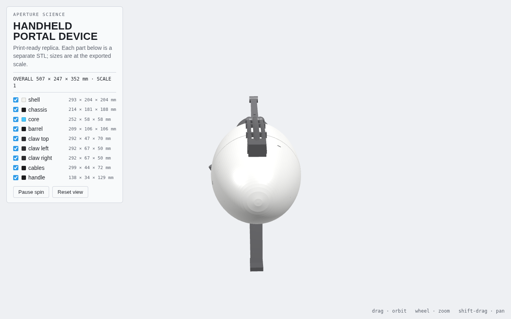

# Portal Gun replica (Aperture Science Handheld Portal Device)

A 3D-printable replica of the portal gun from *Portal* / *Portal 2*: the white
egg-shaped shell, the black inner chassis and front barrel, the glowing blue
core, three articulated claws, the cable run over the top, and the grip.



| | |
| --- | --- |
|  |  |
|  |  |

Open `viewer.html` in any browser to orbit the model and toggle parts. Every
part is generated by `build_portal_gun.py`, so any dimension can be changed and
the STLs regenerated.

## Files

| File | What it is |
| --- | --- |
| `stl/portal_gun_full.stl` | The whole gun as one watertight solid (for display or scaling down) |
| `stl/shell.stl`, `stl/shell_left.stl`, `stl/shell_right.stl` | White shell, whole and split down the middle for printing |
| `stl/chassis.stl` | Black inner body that fills the shell opening, with the cable port on top |
| `stl/core.stl` | The blue core tube and muzzle emitter |
| `stl/barrel.stl` | Black front barrel with muzzle ring, vents and the three struts |
| `stl/claw_top.stl`, `stl/claw_left.stl`, `stl/claw_right.stl` | The three claws |
| `stl/cables.stl` | Three cables plus their clamps |
| `stl/handle.stl` | Grip, trigger and trigger guard |
| `portal_gun.glb` | Coloured model for any 3D viewer or Blender |
| `viewer.html` | Self-contained WebGL viewer, no dependencies |

Axes: +X is forward out of the muzzle, +Z is up. All parts share one origin, so
importing them together into a slicer reassembles the gun.

## Size and scale

At scale 1.0 the gun is 507 mm long, close to the real prop. Part sizes:

| Part | Size (mm) |
| --- | --- |
| Shell (whole) | 293 × 204 × 204 |
| Shell half | 293 × 102 × 204 |
| Chassis | 214 × 181 × 188 |
| Barrel | 209 × 106 × 106 |
| Core | 252 × 58 × 58 |
| Claw (each) | 292 × 67 × 50 |
| Cables | 299 × 44 × 72 |
| Handle | 138 × 34 × 129 |

The shell halves need a 300 mm bed at full size. For a common 220 × 220 mm
printer, scale everything by 0.7 (355 mm gun), or by 0.4 for a desk model.
Regenerate at any scale with:

```sh
pip install trimesh manifold3d shapely numpy
python3 build_portal_gun.py --scale 0.7
```

Scaling in the slicer works too as long as every part gets the same factor.

## Printing

| Part | Orientation | Supports | Colour |
| --- | --- | --- | --- |
| Shell halves | Flat cut face down | None | White (gloss) |
| Chassis | Rear face down | Light, for the port block | Black |
| Barrel | Rear face down | None | Black |
| Core | Standing on end | None | Translucent blue, or clear for an LED |
| Claws | Lie flat on the widest face | Light under the joints | Black or dark grey |
| Cables | Flat on the bed, as exported | Yes, under the free span to the barrel | Black |
| Handle | Flat on its side | Light inside the loop | Black |

- Wall thickness on the shell is 6 mm, so 3 perimeters and 10 % infill is plenty.
- The shell halves have four 4.2 mm alignment holes on the cut face. Cut 4 mm
  filament or dowel into 16 mm pins, glue, and the halves line up on their own.
- Assembly order: glue the chassis into the shell, then the core into the
  chassis, then the barrel onto the core and struts, then the claws onto the
  shell rim, cables on top, and the handle underneath. Every mating part
  overlaps its neighbour by a few millimetres in the model, so there is a real
  glue surface.
- For a lit core, print the core part in clear or translucent filament and run
  a strip of blue LEDs (or a single 5 mm LED at each end) up the tube before
  gluing the barrel on. The chassis is hollow enough for a AA battery holder.
- Sand and prime the shell before painting; the rest can be printed in colour.
